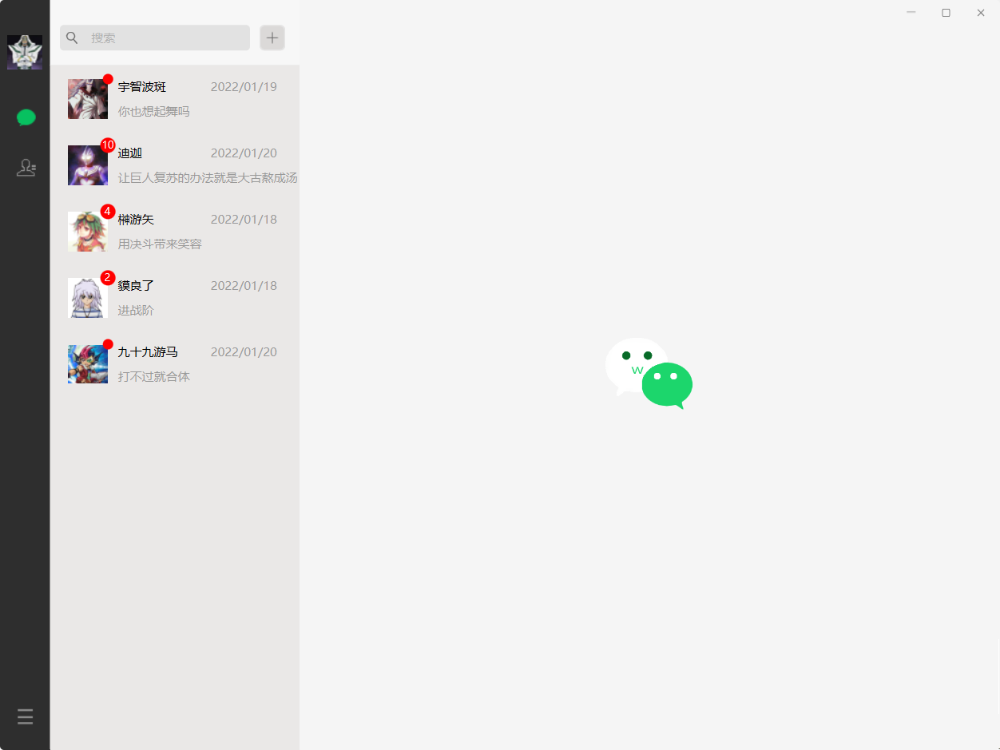
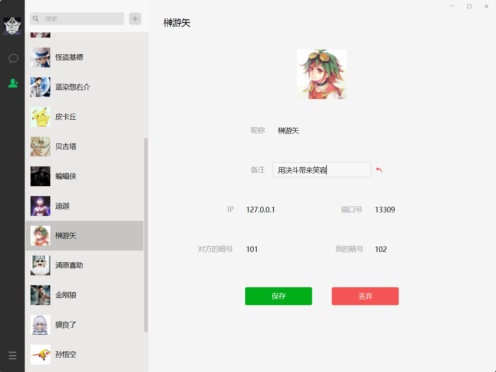
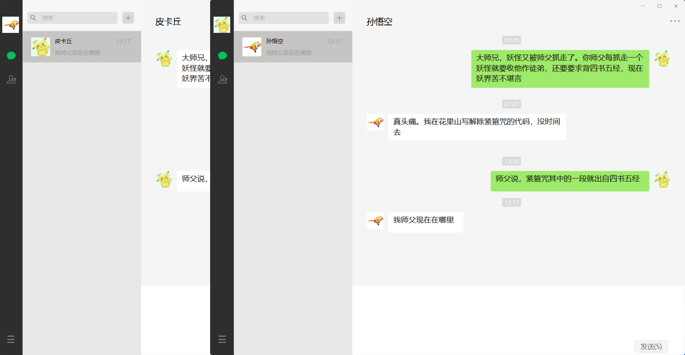

# 高仿版 Windows 端微信

* 此代码是作者出于兴趣爱好自己编写的。转载请注明。

* 作者的邮箱：contactwangpai@163.com

---

分支 M # 版本 ` M.0.0 ` 支持的功能：（以用户的角度）

1. 高仿微信界面，深耕每一个细节。
2. 通过 IP、端口号、通信暗号三者一致来进行通信。支持双向通信。
3. 提供联系人列表、联系人详细信息界面。联系人人数不限。
4. 添加好友无需对方同意且不会引起对方感知。
5. 提供聊天会话列表、聊天对话界面。会话列表个数不限。
6. 支持聊天记录的本地保存与读取。
7. 支持个人信息的更改，如头像等。
8. 自制应用图标、按钮图标。
9. 支持同一台电脑运行多个本应用，登录用户可不同。

---

深耕每一个细节：

1. 实现鼠标在各种按钮停靠与点击时，与原生一致的图标变化效果。
2. 对于不同长度的对话消息，对话框能够自动根据文本长度进行尺寸调节。
3. 实现文本框回车发送信息而不换行，但组合键 Ctrl + Enter 换行。
4. 当用户没有进行输入而点击发送时，弹出一段时间自动消失的信息提示。
5. 支持会话框未读消息红点。支持免打扰消息红点不显示数字。
6. 对不同时刻的消息，会话列表显示的时间格式不同。
7. 随机初始头像，可点击更换。

----

# 为什么要开发本项目

&emsp;&emsp;[微信](https://weixin.qq.com/)是一个很卓越的项目，不过使用过程中仍然有很多限制与缺陷，作者希望开发一个供个人使用的项目来弥补其中的不足。另外，每个企业内部通信时实际上都会使用自己的通信软件。微信虽然很安全，但是将数据托管至第三方会带来一定的风险与限制。受
GitLab 的影响，作者希望能有朝一日开发出一套通用的 IM 通信软件，支持每个企业自行掌控企业内部的通信数据。

&emsp;&emsp;微信中有很多优秀的设计，自行设计出一套 UI 界面不如借鉴原有的优秀设计。除了个别几处之外，本项目的 UI 界面均参考至原本的微信界面，在此作者对微信团队表示深深的谢意。

&emsp;&emsp;因此，本项目为开源项目，作者承诺，不会以任何形式通过本项目来盈利。在项目中，不会有任何营销广告。本项目仅供学习交流，请勿使用本项目进行盈利甚至犯罪用途，否则一切后果由该组织或个人承担，作者不承担任何法律及连带责任。

# 技术指南

&emsp;&emsp;本项目是基于 P2P 技术实现的通信，通信原理基于 IP 与端口号。在通信过程中每个用户互为客户端、服务端。用户之间使用 Netty 来进行通信，GUI 界面则使用 JavaFX 来绘制，本地数据库使用的是 MySQL，ORM 框架使用的是 MyBatis，整个项目使用 SpringBoot 将各部分连接起来。更多的信息，可见 `本项目的开发文档`。

# 使用指南

1. 本项目代码需要在如下环境中运行：

* Windows
* Java
* Maven
* MySQL

2. 需要自行安装 MySQL 并至少事先在数据库中配置联系人信息、登录本应用的用户 ID。如果想要实现在互联网范围内通信，还需要自行解决内网穿透问题。其中，

   * 配置 `登录本应用的用户 ID`：这需要在 MySQL 表 registry 中添如下一列：

     `name`：`MY_ID`

     `value`：`用户 ID。此 ID 必须已经在表 User 中已定义，且与 User.id 一致`

   * 配置联系人信息：根据表结构在表 User 中添加

3. 在模块 `wchat-center` 的资源目录下的文件 `application.properties` 中配置数据库信息，如数据库 URL、数据库端口号、数据库用户名及密码等。

4. 上述配置完成之后，在模块 `wchat-center` 的类 `Entrance` 中启动本项目。

# 基本信息

——2022年1月17日

---

* 本项目使用的开发环境：

    - JDK 17.0.1 2021-10-19
    - Maven 3.8.3
    - MySQL 8.0.27
    - IntelliJ IDEA 2021.2.2 (Ultimate Edition)

---

* 核心 Java 语言代码文件：

* 程序启动入口 API：

  > 模块 `wchat-center` 中的
  >
  >  > 包 `org.wangpai.wchat` 中的
  >  >
  >  > > 类  `Entrance` 中的
  >  > >
  >  > > > 静态方法 `main`

---

* 总计：11500

* Java 代码：9250

    - 测试代码：未统计

* 文本语言代码：2250

    - FXML：648
    - CSS：1093
    - Properties：12
    - POM 文件：497

---

* 运行效果图：（如果图片不能显示，请尝试刷新本页面）

---

---

---

---

---

---

