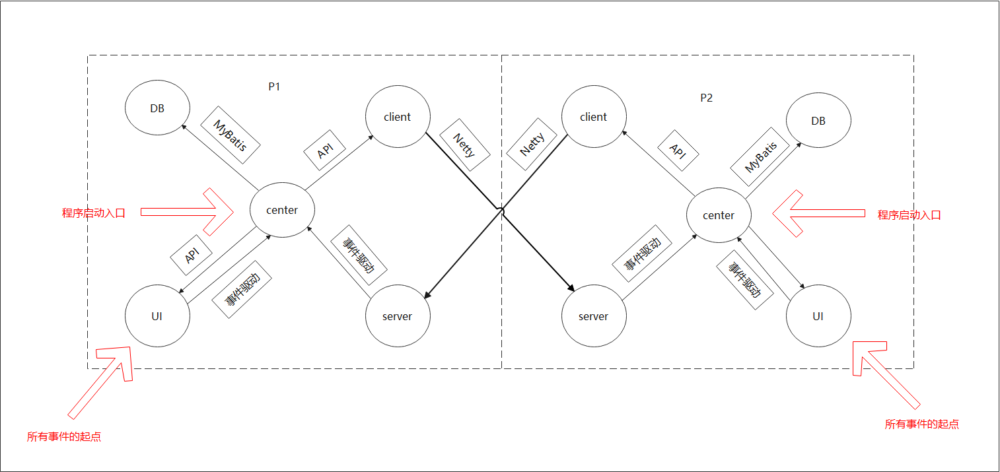
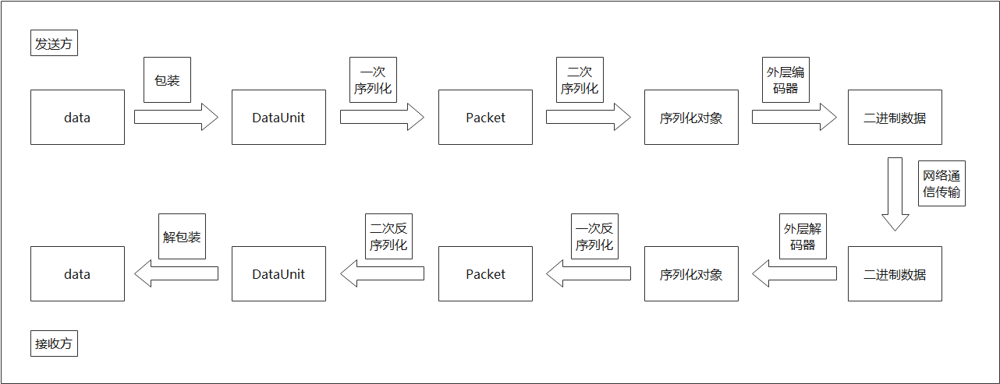
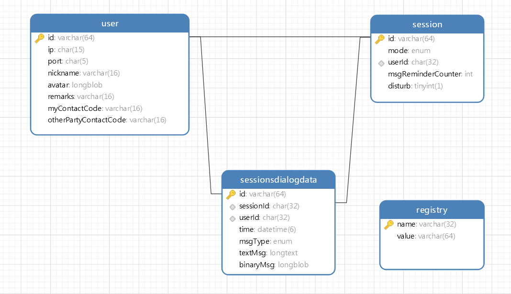

[TOC]

<div align='center' ><font size='70'>技术内幕</font></div>

<p align="right">（版本 M.0.0）</p>

<p align="right">——2022年1月17日</p>

# 架构模式

&emsp;&emsp;本项目采用了架构模式 MVC、C/S、事件驱动模式。具体来说，项目分为以下几个模块：

* DB：数据库
* UI：提供 UI 界面的实现
* Client：对外发送消息的模块
* Server：接收外部消息的模块
* Center：应用中心，充当中介者。也是其它模块唯一能直接交互的对象。

&emsp;&emsp;其中，在模块 UI、Server 中使用了事件驱动模式来向 Center 发送信息，但 Center 向其它模块发送消息则是直接通过各模块对外提供的 API。



# 技术内幕

## 总括

&emsp;&emsp;本项目是基于 P2P 技术实现的双向通信，通信原理基于 IP 与端口号。在通信过程中每个用户互为客户端、服务端。通信一方向另一方发送消息时，不需要经由一个中间服务器转发。

&emsp;&emsp;通信双方的通信是使用 Netty 来实现的，已解决 Netty 传输过程中的半包-粘包、断线重连问题。可实现对 Java 对象的透明传输。目前，通信过程使用的数据载体为 JSON。

&emsp;&emsp;GUI 界面使用 JavaFX 来绘制，其中使用了 FXML 用于布局。JavaFX 拥有自己的线程，不会阻塞主线程。

&emsp;&emsp;保存应用的数据是依靠数据库来实现的。目前，本项目使用的数据库为 MySQL，使用的 ORM 框架为 MyBatis。

## 需要时才连接

&emsp;&emsp;受 Git 与 SVN 的区别的影响，作者选择了一种类似于 Git 的通信模式。本项目中，在双方进行通信时，只有一方发消息的那一刻，双才需要建立连接，其它时候，连接可建立，也可中断。双方并不需要时时刻刻检查并保持连接的通畅。

## 事件驱动模式

&emsp;&emsp;在模块 UI、Server 中使用了事件驱动模式来向 Center 发送信息。这里使用了控制反转的思想，Center 并没有向其它模块提供用于向 Center 发送消息的 API，而是改为各个其它模块向 Center 暴露一个需要其实现并注入的接口，然后当模块需要向 Center 传递消息时，只需要调用自己的这个接口的方法，并将消息作为形参传入即可。

## 对 Java 对象的透明传输

&emsp;&emsp;通信链路本质上只能传输二进制数据，因此不能直接传输 Java 对象。可以使用将 Java 对象进行序列化的方法，先将 Java 对象转化为二进制数据，然后进行传输。在接收端，使用反序列化的方法还原出原来的 Java 对象。

## 二次序列化

&emsp;&emsp;Java 对象的反序列化有一个缺陷，那就是反序列化前必须提前知晓 Java 对象的真实类型，这个真实类型还包括这个 Java 对象的字段的真实类型。然而，因为 Java 支持也鼓励向上引用，因此类字段中经常能看到接口，如果不给出类字段指向的对象的真实类型，反序列化将会失败。

&emsp;&emsp;如果接收端可以确定发送端所发数据的类型，比如事先进行了细致的约定，那么这不会有问题。但如果不能确定，这需要在传输时同时传入相关的数据类型。这就需要接收端在接收时进行二次序列化。具体算法如下。

---

&emsp;&emsp;首先通信双方需要先构造如下类型：

* 假设实际要传输的数据为 `data`，但这个数据的类型不固定。

* 内部传输对象类型 `DataUnit`。这是通信一方内部代码可以直接使用的类型。`DataUnit` 的字段如下：

  - `data`：实际要使用的数据。因为此数据的真实类型不固定，所以此字段的类型为 `Object`。
  - `identifier`：记录 `data` 的真实类型。

* 通信外壳对象类型 Packet。这是最终在通信链路上透明传输的 Java 对象类型。Packet 的字段如下：

  - `carrier`：`data` 在一次序列化之后的数据。
  - `carryingType`：`data` 的真实类型。
  - 其它任意个数的固定字段，它们的类型需明确。

---

&emsp;&emsp;算法如下：

* 发送端：
  1. 将实际数据 `data` 封装至 `DataUnit` 中。此时，`DataUnit` 中应该记录了 data 的真实类型。
  2. 使用 `DataUnit` 中的字段 `identifier` 来对 `DataUnit` 中的 `data` 进行一次序列化，并把结果和 `identifier` 封装到 `Packet` 中。
  3. 对 `Packet` 进行二次序列化，转化为最终的序列化对象。
  4. 外层编码器将序列化对象转化为最终可在通信链路中传输的数据，并发送。

* 接收端：
  1. 从接收的数据中解码出原始的序列化数据。
  2. 对序列化数据进行反序列化，得到 `Packet` 对象。
  3. 从 `Packet` 对象取出二次序列化需提供的类型 `carryingType`，并据此将字段 `carrier` 进行二次序列化。然后将结果和 `carryingType` 封装至 `DataUnit` 中。
  4. 根据 `DataUnit` 中的字段 `identifier`，从 `DataUnit` 中取出实际要用的数据 `data` 。

---

示意图如下：



# 自研算法

## 实现文本框回车发送信息而不换行，但组合键 Ctrl + Enter 换行


实现的算法大致如下：

1. 使用 TextArea 的处理器 onKeyPressed 来监听 TextArea 的键盘输入事件。

2. 如果监听到用户输入了回车，作如下判断：

   1. 如果用户输入的不是组合键 `Ctrl + Enter`，去掉刚刚输入的换行符，然后将文本发送。此时可以选择清空文本框的内容还是保持文本框的内容不变。然后本算法结束。

   2. 如果用户输入的是组合键 `Ctrl + Enter`，在光标处插入换行符，然后将光标移至到换行符之后。然后本算法结束。

3. 如果用户没有输入回车，什么也不做，本算法结束。

---

主要的注意事项如下：

* 文本框光标的范围是 [0, length]。因为光标指向文字左右及之间的空隙，而空隙的数量比文字多 1。

* 处理器 onKeyPressed 的回调方法是在用户按下按键（还没释放之前）就马上触发。

* TextArea 不认为输入的组合键为单独依次这些键的效果之和。这意味着，在按下但不松开 Ctrl 键之后，输入 Enter 时，输入的文本不会包含换行符，因为 TextArea 不认为此时输入的是 Enter。但如果依次按下（不松开） `a`、`Enter`，则输入的文本为 `a\n`。

* 在 onKeyPressed 的回调方法中，当用户输入的是普通的按键时，光标的位置为输入该字符之前的位置（刚刚输入的字符尚未在文本框中生效）。如果用户输入的是特殊的按键（如 Ctrl、Alt 、Enter 等），光标的位置为此键生效之后光标的位置。另外，。这意味着，如果输入的是 Enter，则当 onKeyPressed 的回调方法触发时，文本框中不仅包含换行符，而光标在该换行符之后。

* 在拼接光标两侧的文本时，Enter 与组合键 `Ctrl + Enter` 的光标位置与文本内容均有差异。对于 Enter，需要清除换行符，而输入的换行符位于光标的左边。对于组合键 `Ctrl + Enter`，不仅要插入换行符，还要将光标的位置右移。

* Windows 会将回车解释成 `\n\r`，但 TextArea 清除文本中所有的 `\r`。换句话说，当在 Windows 输入回车时，实际上输入的是 `\n\r`。但当向 TextArea 输入 `\n\r` 时，TextArea 会移除所有的 `\r`。从 TextArea 得到的字符串中不会包含任何 `\r`。

* 方法 `keyEvent.isControlDown()` 并不是用来判断触发 onKeyPressed 的按键（刚刚按下的按键）是不是键  `Ctrl` ，而是用来判断，在调用方法 `keyEvent.isControlDown()` 时，已经按下且未松开的按键含不含键 `Ctrl`。因此，如果使用该方法，就无需自行记录用户按下与释放的每一个键了。

---

## 计算文本所占像素的宽度

&emsp;&emsp;这是为了实现对话框能根据文本内容自动调整大小，这个大小不仅包括高度，还包括宽度。

---

&emsp;&emsp;主要的注意事项如下：

* 计算后最终的行宽值不会大于 TextArea 的行宽值。另外，当文本内容超过 TextArea 的最大宽度时，会触发换行。因此，还需要计算 TextArea 自动换行后的行数。

* 用户输入的原始内容中就有可能包含换行。对这种情况可以有不同的处理方案，但是需要考虑这个问题。如果不选择直接去除换行符，则需要先将用户输入分割成各个不含换行符的文本，然后分别统计这些文本的行数与最大行宽，最后加行数相加，并来取这些最大行宽中的最大值。

* Windows 会将回车解释成 `\n\r`，但 TextArea 清除文本中所有的 `\r`。换句话说，当在 Windows 输入回车时，实际上输入的是 `\n\r`。但当向 TextArea 输入 `\n\r` 时，TextArea 会移除所有的 `\r`。从 TextArea 得到的字符串中不会包含任何 `\r`，TextArea 的换行符为 `\n`。

* 行数只能是整数。另外，如果使用整数除法，需要将结果加 1。因为不满 1 行也需要占用一行。

* 考虑用户的特殊输入：
  
  * 输入为空串

  * 输入的内容全是换行符

  * 输入的内容存在连续的换行符

  * 输入的开头是换行符

---

&emsp;&emsp;实现的算法大致如下：

（假设：当用户输入内容包含换行符时，不管是否连续，也直接进行原始输出而不删除。当用户输入的内容为空时，不报错，也直接视文本长度为 0 来计算）

1. 判断输入是否为 null 或空串，如果是，视文本行宽为 0，行数为 1。如果不是，进行下一步。


2. 判断输入是否只有换行符，如果是，视文本行宽为 0，行数为换行符的个数。如果不是，进行下一步。

3. 将输入按照换行符分割成各个不含换行符的文本，然后先计算单个文本尺寸，最后叠加。方法如下：
   
   1. 计算单个文本的尺寸。方法如下：
      
      1. 求文本的原始像素长度。

      2. 计算文本的行宽值：取像素长度与单行文本最大长度之间的最小值。

      3. 计算文本的行数：将像素长度除以单行文本最大长度，然后向上取整。

   2. 计算整个文本的行宽值：取各个文本行宽值的最大值。

   3. 计算整个文本的行数：将各个文本行数值累加。

4. 计算文本框的宽度：将文本的行宽值与文本框左右内边距相加。

5. 计算文本框的长度：将文本的行数乘以单行文本行高，然后加上文本框上下内边距。

# 特色功能

## 通信暗号

&emsp;&emsp;由于没有使用服务器作为控制中心，自然就没有“账号”这种说法。因此，这里通过通信暗号来控制是否接收对方的消息。通信暗号是以会话为单位而成对出现。对于每个会话，会话双方可以为自己和对方分别填写一个通信暗号。如果想要向对方发消息，需要自己为对方填写的通信暗号与对方为自己填写的通信暗号一致。如果不想接收对方的消息，可以更改自己的通信暗号，但此时自己向对方发消息不受影响。

## 无声加好友

&emsp;&emsp;添加好友无需对方同意且不会引起对方感知。这是因为添加好友只是将好友的个人信息保存在了联系人列表中而已。如果想要向对方发消息，还需要知晓对方的通信暗号。

# 数据库

&emsp;&emsp;目前，底层使用的数据为 MySQL，但由于使用了 ORM 框架进行隔离，所以也可以根据自己的实际情况换成其它数据库。

&emsp;&emsp;目前，数据库的建表情况如下：

* User：所有用户的个人信息表

|                  列名 | 意义                     |
| --------------------: | :----------------------- |
|                    id | User 的主键              |
|                    ip | IP                       |
|                  port | 端口号                   |
|              nickname | 昵称                     |
|                avatar | 头像                     |
|               remarks | 备注                     |
|         myContactCode | 自己为自己设置的通信暗号 |
| otherPartyContactCode | 自己为对方设置的通信暗号 |

* Session：会话信息表

|               列名 | 意义                                       |
| -----------------: | :----------------------------------------- |
|                 id | Session 的主键                             |
|             userId | Session 的外键，对应着 User.id             |
|               mode | 会话模式。标识这个会话属于双方聊天还是群聊 |
|            disturb | 表示新消息是否允许打扰                     |
| msgReminderCounter | 未读消息数                                 |

* SessionsDialogData：聊天消息记录表。一行代表一个会话中的一条消息记录

|      列名 | 意义                                                      |
| --------: | :-------------------------------------------------------- |
|        id | SessionsDialogData 的主键                                 |
| sessionId | SessionsDialogData 的外键，对应着 Session.id              |
|    userId | SessionsDialogData 的外键，对应着 Session.id              |
|      time | 本条消息时间                                              |
|   msgType | 消息的类型。标识该消息内容是本文消息还是二进制信息        |
|   textMsg | 本文消息。本行本列只有在 msgType 为文本时才有意义         |
| binaryMsg | 二进制消息。本行本列只有在 msgType 为二进制数据时才有意义 |

* Registry：注册表。只有两列的键值对表，用于存放本应用的必要信息

|  列名 | 意义         |
| ----: | :----------- |
|  name | 键名         |
| value | 键所对应的值 |



数据库建表示例代码如下：

```mysql
CREATE DATABASE 数据库名;

USE 数据库名;

CREATE TABLE User (
    id VARCHAR(64),
    ip CHAR(15),
    port CHAR(5), # port 不要设置为整数类型。port 用字符串表示时，只需要 5 位
    nickname VARCHAR(16),
    avatar LONGBLOB,
    remarks VARCHAR(16),
    myContactCode VARCHAR(16),
    otherPartyContactCode VARCHAR(16),

    PRIMARY KEY (id)
);

# 规定：session.id 与 session.contactsId 相等
CREATE TABLE Session (
    id VARCHAR(64),
    mode ENUM("PAIR","GROUP"),
    userId CHAR(32),
    msgReminderCounter INT,
    disturb TINYINT(1),

    PRIMARY KEY (id),
    FOREIGN KEY (userId) REFERENCES User (id)
);

CREATE TABLE SessionsDialogData (
    id VARCHAR(64),
    sessionId CHAR(32),
    userId CHAR(32),
    time DATETIME(6),
    msgType ENUM("TEXT","BINARY"),
    textMsg LONGTEXT,
    binaryMsg LONGBLOB,

    PRIMARY KEY (id),
    FOREIGN KEY (sessionId) REFERENCES Session (id),
    FOREIGN KEY (userId) REFERENCES User (id)
);

# 注意：key 在 MySQL 中是关键字，不能作为列名
CREATE TABLE Registry (
    name VARCHAR(32),
    value VARCHAR(64),

    PRIMARY KEY (name)
);
```